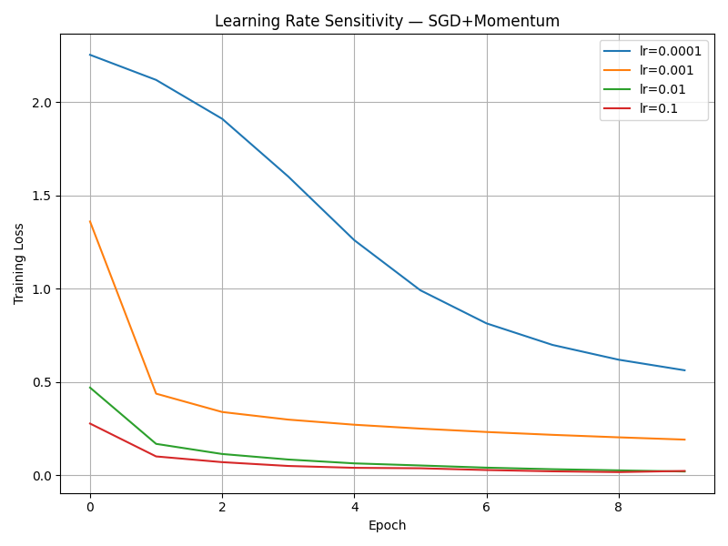

## Assignment 2.1.B — Learning Rate Sensitivity & Stability

We evaluated the effect of learning rate on training stability and convergence
using a fixed optimizer (SGD with momentum = 0.9) and a fixed MLP architecture
on MNIST.

### Experimental Setup
- Optimizer: SGD + Momentum (0.9)
- Learning Rates: [1e-4, 1e-3, 1e-2, 1e-1]
- Epochs: 10
- Dataset: MNIST (80/20 train/val split)
- Metric: Training Loss, Validation Loss, Validation Accuracy

## Results & Observations

**1. Very Small Learning Rate (lr = 0.0001)**
When using a very small learning rate, the optimization process was highly stable but inefficient. Training loss decreased monotonically across epochs; however, convergence was slow, and the model failed to reach a well-optimized solution within the fixed 10-epoch budget. Validation accuracy improved gradually but remained noticeably lower than other learning rate settings. This behavior illustrates a classic underfitting scenario caused by insufficient step sizes, where the optimizer makes progress but cannot explore the loss landscape effectively in a reasonable time frame.

**2. Moderate Learning Rate (lr = 0.001)**
At a learning rate of 0.001, SGD with momentum demonstrated a strong balance between convergence speed and stability. Both training and validation losses decreased smoothly, and validation accuracy improved consistently without noticeable oscillations. The optimization process remained well-controlled throughout training, making this learning rate a reliable and stable baseline. This regime reflects a learning rate that is large enough to make meaningful progress while still preserving stable gradient updates.

**3. High Learning Rate (lr = 0.01)**
A learning rate of 0.01 resulted in significantly faster convergence. The model achieved low training loss and high validation accuracy within the first few epochs, while maintaining stable optimization behavior. Validation performance remained strong, indicating good generalization. This learning rate represents a near-optimal setting for this architecture and dataset, maximizing training efficiency without introducing instability. It highlights how an appropriately tuned learning rate can substantially improve both convergence speed and final performance.

**4. Very Large Learning Rate (lr = 0.1)**
With a learning rate of 0.1, the model initially converged extremely quickly, reaching low training loss and high validation accuracy early in training. However, as training progressed, validation loss began to increase and fluctuate despite continued reductions in training loss. This divergence between training and validation performance indicates instability and reduced generalization, caused by overly aggressive parameter updates that overshoot minima and lead to oscillatory behavior.

**5. Overall Conclusion**
These experiments demonstrate that the learning rate is one of the most critical hyperparameters governing optimization dynamics in deep neural networks. Very small learning rates lead to slow convergence and underfitting, while excessively large learning rates introduce instability and degrade generalization. For SGD with momentum on MNIST, a learning rate around **0.01** provided the best trade-off between fast convergence, training stability, and strong validation performance. The empirical results closely align with theoretical expectations regarding gradient-based optimization in deep networks.

- lr=1e-4 converged slowly but remained stable.
- lr=1e-3 showed balanced convergence and good generalization.
- lr=1e-2 achieved the fastest and most stable convergence, yielding the
  highest validation accuracy.
- lr=1e-1 caused validation instability despite decreasing training loss,
  indicating overshooting and poor generalization.

### Conclusion
Learning rate is a critical hyperparameter that strongly affects optimization
stability and generalization. Even with momentum, excessively large learning
rates lead to unstable validation behavior. This experiment confirms that
proper learning rate selection is essential for effective training.
