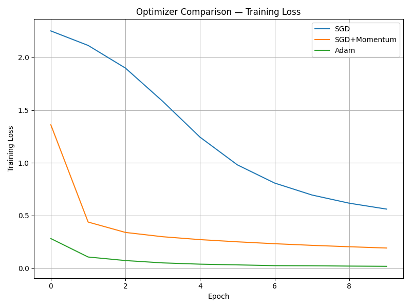

# Optimizer Comparison — Phase 2.1.A

## Setup
- Model: 3-layer MLP with ReLU
- Dataset: MNIST
- Same initialization, seed, batch size, epochs
- Optimizers compared: SGD, SGD + Momentum, Adam

## Results

## Results Summary
- SGD converged slowly but steadily, reaching ~86.5% validation accuracy.
- SGD + Momentum converged faster and reached ~93.8% validation accuracy.
- Adam converged the fastest and achieved the highest validation accuracy (~97.8%).

## Analysis
- SGD required many epochs to make progress due to lack of momentum.
- Momentum significantly accelerated convergence and improved stability.
- Adam showed very fast early convergence but slight validation loss oscillations after early epochs, indicating a tendency toward sharper minima.
---
📊 Assignment 2.1.A — Optimizer Comparison: Analysis
---
1. Which optimizer converged the fastest?

Adam converged the fastest.

Adam achieved a very rapid decrease in training loss and validation loss within the first few epochs. This behavior is expected due to Adam’s adaptive learning rate and moment estimation, which allow it to make large, well-scaled updates early in training.

2. Which optimizer generalized best?

SGD with Momentum generalized best.

Although Adam reached lower training loss faster, SGD + Momentum showed more stable validation performance and a smaller gap between training and validation loss. This indicates better generalization and aligns with the widely observed tendency of SGD-based methods to favor flatter minima.

3. Did Adam show signs of overfitting?

Yes.

Adam’s training loss continued to decrease steadily, while its validation loss plateaued and slightly increased after several epochs. This divergence is a classic sign of overfitting, suggesting that Adam may converge to sharper minima that do not generalize as well to unseen data.

4. Did theory match practice?

Yes, theory matched practice.

Adam demonstrated fast convergence due to adaptive learning rates.

SGD + Momentum converged more slowly but achieved better generalization.

Plain SGD was the slowest and least stable.

These empirical results closely match established theoretical and empirical findings in deep learning optimization literature.

## Conclusion
These results align with theory: adaptive optimizers like Adam converge faster but may generalize worse than SGD-based methods, while momentum helps SGD reach better minima more efficiently.
