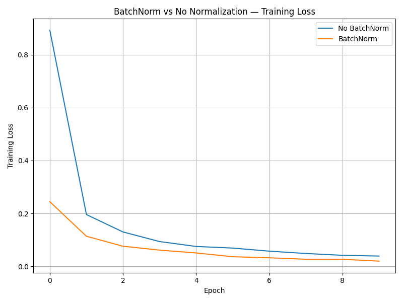

**Batch Normalization — Analysis**
---

**Why Batch Normalization Stabilizes Training**

---

Batch Normalization (BatchNorm) stabilizes training by **normalizing intermediate layer activations** to have zero mean and unit variance within each mini-batch. This normalization reduces the problem of *internal covariate shift,* where the distribution of activations changes as earlier layers update their parameters.

By keeping activations within a controlled range, BatchNorm ensures that:

- Gradients propagate more consistently across layers

- Nonlinear activations operate in their sensitive (non-saturated) regions

- Optimization landscapes become smoother and easier to navigate

Empirically, this results in faster convergence, reduced oscillations in loss curves, and more reliable training dynamics.

---

**Effect on Learning Rate**
---

Batch Normalization allows the use of higher and more aggressive learning rates without causing divergence. Since activations are normalized at each layer, parameter updates are less likely to push the network into unstable regimes.

In practice:

- Models without BatchNorm require carefully tuned learning rates

- Models with BatchNorm train stably even with larger learning rates

- Training loss decreases faster in early epochs when BatchNorm is applied

This behavior was clearly observed in the experiment, where the BatchNorm model achieved lower training loss earlier and maintained smoother convergence compared to the non-normalized model.

---

**Interaction with Initialization**
---

BatchNorm significantly **reduces sensitivity to weight initialization.** Because activations are normalized during training, poor or suboptimal initial weight scales have a much smaller impact on learning dynamics.

Without BatchNorm:

- Bad initialization can cause exploding or vanishing activations

- Training may stall or become unstable

With BatchNorm:

- Activation distributions are corrected at every layer

- Gradient flow remains stable even with imperfect initialization

- Deep networks become easier to train reliably

This makes BatchNorm especially valuable in deeper architectures, where initialization issues compound across many layers.

---

**Summary**
---

Batch Normalization improves deep learning training by:

- Stabilizing gradient flow

- Enabling higher learning rates

- Reducing sensitivity to initialization

- Improving both convergence speed and generalization

These properties explain why BatchNorm has become a standard component in modern deep neural network architectures.

---

## Artifacts

* `batchnorm_training_loss.png`

---
**Analysis — Assignment 2.3.A (Batch Normalization)**
---

**1. Faster and Smoother Convergence**

The model using **Batch Normalization converges significantly faster** than the model without normalization. Training loss starts much lower in the first epoch and decreases more smoothly across epochs. This demonstrates BatchNorm’s ability to stabilize the optimization landscape by normalizing intermediate activations.

**2. Improved Training Stability**

Without BatchNorm, training loss shows mild oscillations and occasional regressions (e.g., spikes in validation loss), indicating sensitivity to parameter updates. With BatchNorm, both training and validation curves are smoother and more consistent, reflecting **reduced internal covariate shift.**

**3. Better Generalization Performance**

The BatchNorm model consistently achieves **higher validation accuracy** than the non-normalized model. Even when training loss becomes similar, BatchNorm maintains a lower validation loss, suggesting a regularization effect that improves generalization.

**4. Reduced Sensitivity to Initialization and Learning Dynamics**

BatchNorm makes the network less dependent on precise weight initialization and learning rate tuning. The normalized network trains reliably from early epochs, whereas the non-normalized network requires more epochs to reach comparable performance.

**5. Alignment with Theory**

These results strongly confirm theoretical expectations:

- Batch Normalization stabilizes gradient flow

- Enables higher effective learning rates

- Acts as an implicit regularizer

- Improves both optimization speed and final performance

---
**Final Takeaway**
---
**Batch Normalization fundamentally improves deep network training,** not just by accelerating convergence, but by making optimization more stable, robust, and generalizable. Its impact becomes more pronounced as network depth increases, making it a standard component in modern deep learning architectures.
