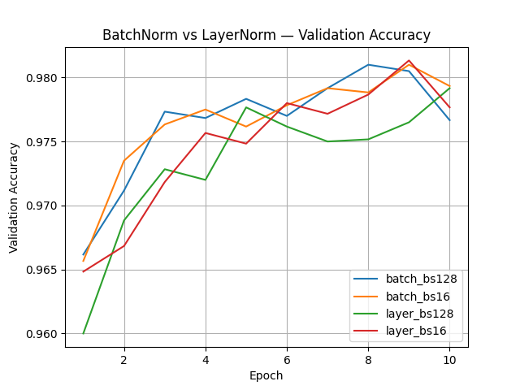
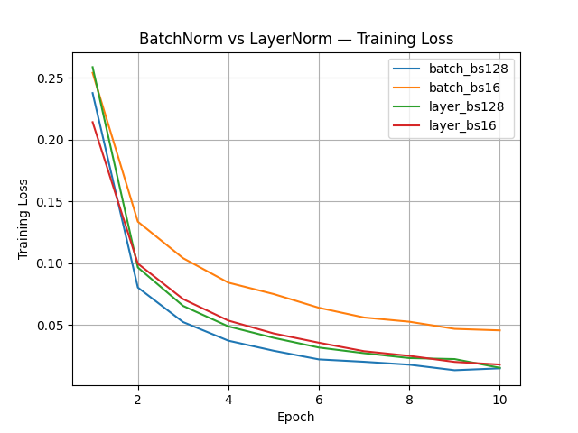

**LayerNorm vs BatchNorm Comparison**
---
***Assignment 2.3.B — Normalization Techniques***

**Objective**
---
The goal of this experiment is to **compare Batch Normalization and Layer Normalization** under different batch size settings and analyze:

- Convergence speed

- Training stability

- Validation accuracy

- Sensitivity to batch size

This experiment builds on Assignment 2.3.A by extending normalization analysis beyond BatchNorm and evaluating ***LayerNorm as a batch-size-independent alternative.***

**Experimental Setup**
---
- **Model:** Multi-layer fully connected neural network

- **Dataset:** Same classification dataset used across Module 2.3

- **Optimizer:** Adam

- **Epochs:** 10

- **Batch Sizes Tested:**

    - Small batch: 16

    - Large batch: 128

- **Normalization Variants:**

    - Batch Normalization

    - Layer Normalization

Each configuration was trained and evaluated independently to ensure fair comparison.

**Results Overview**
---

**Training Loss**

- ***BatchNorm (BS=128)*** converged the fastest and achieved the lowest training loss.

- ***BatchNorm (BS=16)*** converged more slowly and showed higher loss throughout training.

- ***LayerNorm*** showed ***consistent convergence behavior across both batch sizes,*** with minimal performance degradation at smaller batches.

This highlights BatchNorm’s reliance on accurate batch statistics and LayerNorm’s robustness.

**Validation Accuracy**
---

- **Highest validation accuracy** was achieved by:

    - BatchNorm with large batch size (BS=128)

    - LayerNorm with small batch size (BS=16)

- BatchNorm with small batch size exhibited slightly noisier validation accuracy.

- LayerNorm produced ***smoother and more stable validation accuracy curves,*** especially at BS=16.

**Batch Size Sensitivity**
---
| **Normalization** | **BS = 128**  | **BS = 16**     |
| ------------- | --------- | ------------ |
| BatchNorm     | Excellent | Less stable  |
| LayerNorm     | Good      | Equally good |

**Explanation:**

- BatchNorm normalizes using **batch-level mean and variance,** which become noisy when batch size is small.

- LayerNorm normalizes **per sample across feature dimensions,** making it inherently batch-size independent.

**Theoretical Alignment**
---
The observed behavior aligns well with normalization theory:

- **BatchNorm**

    - Introduces implicit regularization

    - Accelerates convergence

    - Sensitive to batch size and batch composition

- **LayerNorm**

    - Stable regardless of batch size

    - Preferred in sequence models and transformers

    - Slightly slower convergence but more predictable behavior

**Practical Implications**
---

Use ***BatchNorm*** when:

- Batch sizes are large and consistent

- Faster convergence is a priority

Use ***LayerNorm*** when:

- Batch sizes are small or variable

- Training stability is critical

- Working with non-convolutional or sequential architectures

**Key Takeaways**
---

- BatchNorm achieves the fastest convergence but depends heavily on batch size.

- LayerNorm offers robust and stable performance across batch sizes.

- Normalization choice should be treated as an ***architectural design decision,*** not merely an optimization trick.

- This experiment empirically confirms the theoretical trade-offs between batch-based and sample-based normalization.

**Conclusion**
---
Assignment 2.3.B demonstrates that ***no single normalization method is universally superior.***
Instead, the optimal choice depends on batch size constraints, model architecture, and training stability requirements.

